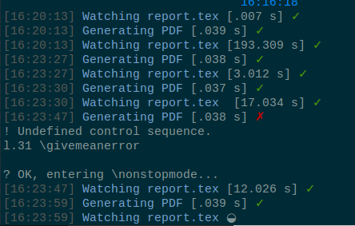
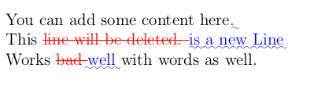

Awesome latex workspace
===

Easy to use watcher + diff latex.

I couldn't find a great name for this other than *boilerplate* so I named it
awesome because it really makes my life easier for reports. Feel free to
open issues if you know about nifty features to improve this.

Remember to install submodules first by either cloning using the `--recursive`
or by doing

```bash
git submodule init
git submodule update
```

## Watcher



Launch `./watcher.sh` and start editing your `report.tex` right away !
Internally the watcher runs the `Makefile` (classic way to compile a latex)

## Git Latex Diff



Uses [git-latex-diff](https://gitlab.com/groups/git-latexdiff) to generate a pdf
with additions and deletions since the last time this command was run. This
command **must** be run after a commit is made **and** after adding the initial
commit to the file `last-commit.sha`.
